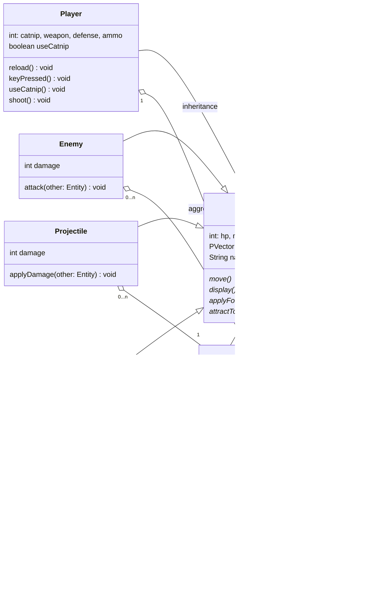

# Technical Details:

(CHANGE THIS!!!!!)

A description of your technical design. This should include: 
   
How you will be using the topics covered in class in the project.

- PERIOD 5
- Alisherjon Turakulov + Jeffery Zhang
- Cat Protégés
- Our project is a game that is a two-dimensional shooter consisting of wave defense gameplay. Each wave consists of spawned enemies and the player is defending a cat in the middle of the map. The enemies spawn with random stats with an upperbound and lowerbound for randomization that depends on what wave the player is on. The wave progresses when all enemies in the map die. After every X waves a shop will appear somewhere on the map for X seconds for the player to upgrade their equipment if they step into the region of the shop. The map itself consists of wall obstacles where some can be damaged by attacks to create debris that slow down the enemies. The game ends when the lowerbound of stat randomization reaches the upperbound.
- Expanded Description
   - After 1.5 weeks we should have the wave system along with the map created with a two-dimensional array, entities from a list of enemy class each with x,y,dx,dy fields for movement, along with a basic system of player shooting and movements composed of similar fields/physics as the Orb class from our Orb Physics classwork (also applies to enemies).
   - It would be awesome to have the cat move around the map where it can climb obstacles and such, therefore increasing the difficulty of the game because the player will have a harder time protecting it from the entities. The player will also be able to lure the cat into safe spots with catnip which hopefully is allowed.
     
# Project Design

UML Diagrams and descriptions of key algorithms, classes, and how things fit together.

    
# Intended pacing:

How you are breaking down the project and who is responsible for which parts.
This project will be broken down into three parts consisting of the NPCs along with the player, the map, and finally the wave defense system along with the shop.
The responsibility for parts will be split in half for each phase, where one of us will work on the player lets say and the other works on the entities for phase one. However, ~Especially~ for larger classes, e.g., Game, Player, Enemy we'll work together on different elements required to get our project in a functioning state.

A timeline with expected completion dates of parts of the project. (CHANGE THIS!!!!!)
- Phase 1 [NPC/Player]
- Entity Class
  - Fields & Constructor
  - movement
  - Player Child Class
    - Fields & Constructor
    - Shooting and reloading
    - Dropping catnip
  - Enemy Child Class
    - Fields & Constructor
    - close attacks
    - plausible type of attack

- Phase 2 [Map]
  - Constructor for Game
  - initialization of game via setup
    - Marked enemy spawns
    - Marked shop spawns
    - Marked player & cat spawn
    - Walls initialized randomly

- Phase 3 [Gameplay/QoL]
- Game Class
  - Fields & Constructors
  - wave incrementing
    - causes adjustments to other classes like enemy (stats)
  - Shop Class
    - upgrades for Defense
    - upgrades for Weapons
  - Wall Class
    - state that turns into debris that damages enemy
    - health
  -QoL TBD
